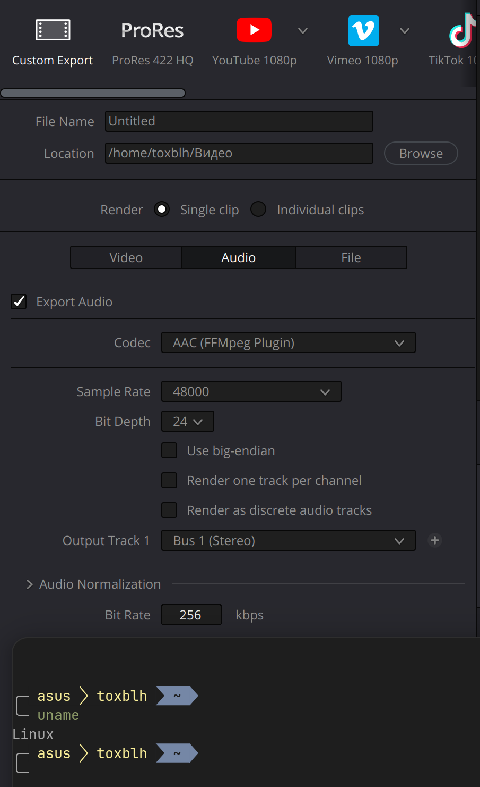

# DaVinci Resolve FFmpeg AAC Audio Encoder Plugin

This project is a DaVinci Resolve audio encoder plugin for AAC using FFmpeg. 
It builds a plugin compatible with the IOPlugins system of DaVinci Resolve Studio (Free doesn't support plugins) for Linux.

<p align="center">  
  
</p>

<p align="center">
  <a href="https://www.paypal.com/cgi-bin/webscr?cmd=_s-xclick&hosted_button_id=WUAAG2HH58WE4" title="Donate via Paypal"></a>
  <a href="https://www.buymeacoffee.com/toxblh" target="_blank"></a>
  <a href="https://www.patreon.com/bePatron?u=9900748"></a>
</p>
<p align="center">
  <a href="https://www.donationalerts.com/r/toxblh" target="_blank"></a>
  <a href="https://boosty.to/toxblh" target="_blank"></a>
</p>

## Features
- AAC encoding using FFmpeg

## Requirements
- DaVinci Resolve Studio (FREE does NOT support plugins!)
- FFmpeg

## Install
- Download aac_encoder_plugin-linux-bundle.tar.gz from [Releases](https://github.com/Toxblh/davinci-linux-aac-codec/releases)
- Unpack
- Exec `./install.sh` (or check Readme inside)

------------

## Build Requirements
- Linux x86-64
- C++ compiler (g++ >= 9 recommended)
- FFmpeg development libraries (`libavcodec-dev`, `libavutil-dev`)
- CMake (if you want to use it)
- Make

### Install dependencies (Ubuntu/Debian example)
```
sudo apt update
sudo apt install build-essential pkg-config libavcodec-dev libavutil-dev
```

## Build

To build the plugin and package it for DaVinci Resolve:

```
./build.sh
```

The output will be in:
```
aac_encoder_plugin.dvcp.bundle/Contents/Linux-x86-64/aac_encoder_plugin.dvcp
```

## Install

To install the plugin into DaVinci Resolve:

```
sudo ./install.sh
```

This will copy the plugin bundle to `/opt/resolve/IOPlugins`.

---

## License
GPLv3
